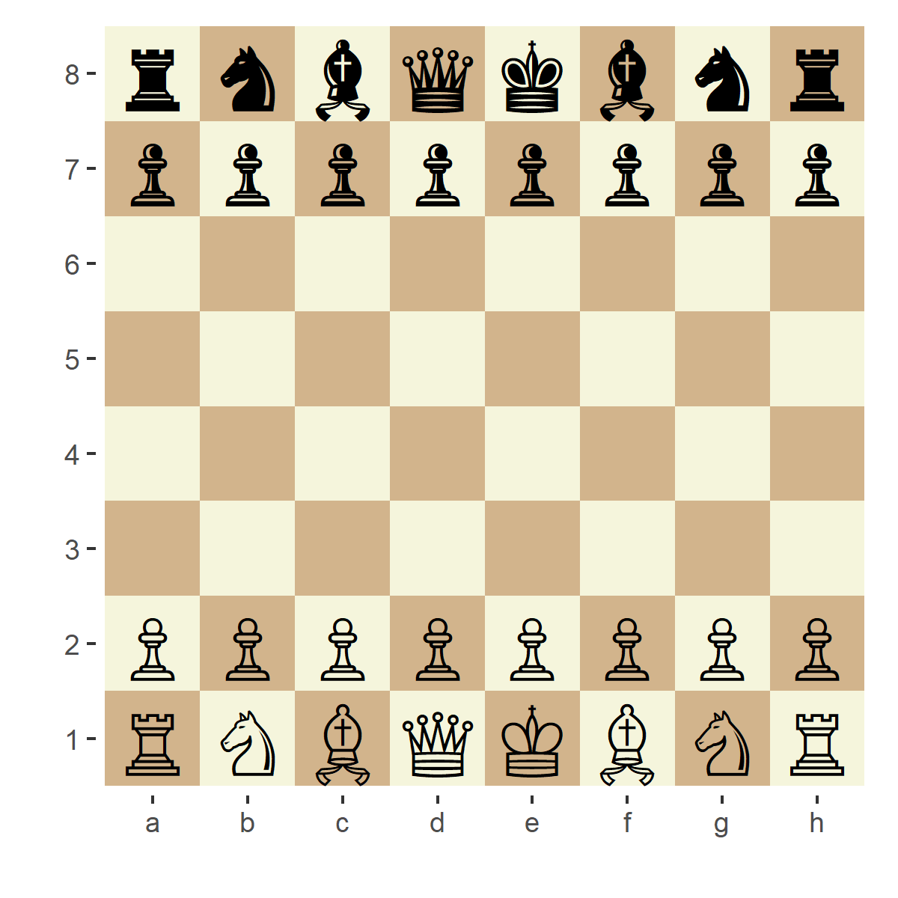

```{r setup, include=FALSE}
knitr::opts_chunk$set(echo = TRUE)
devtools::load_all()
library(memoise) # getting results faster when working on the file
gameAnalysis = memoise(gameAnalysis)
stockStep = memoise(stockStep)
```

## stockfisher

`stockfisher` is an R interface for UCI based chess engines. Any chess engine can
be used but it comes with and tested with stockfish.

### Using stockfisher

The first thing that should be done is to spawn an engine process. If an engine is not 
spawned, `stockStep` and `pgnAnalysis` functions will spawn their own processes and
terminate at function termination which might add some overhead.

To start the stockfish engine that is included in the package, use

```{r}
stockfish = startStockfish()
```

If you want to start a different engine or your own stockfish installation just do

```r
engine = subprocess::spawn_process('path/to/engine')
```

Spawning a process beforehand is also good if you want to set some engine parameters.

```{r}
# see available options
getOptions(stockfish)
# set the move overhead to 30
setOptions(stockfish,optionList = list(`Move Overhead` = 30))
```

### Next best move

`stockStep` function will analyze the current position of the board and return you
the next best move the engine can come up with. It also gives you the best opposing move
(if it can), and the score for the current position from it's perspective (positive
integers if the engine is winning, negative if its losing).

As an input it accepts a `Chess` object from the `rchess` package or a string that
could be read by UCI (FEN notation or something like `startpos moves e2e4`).

```{r}
library(rchess)
library(glue)

board = Chess$new()

# use the position of the board as input
# think for 2 seconds and return the bestmove it could think of
stockStep(board,movetime= 2000, stockfish = stockfish)

# use the string as input
stockStep(posString = glue('startpos moves e2e4'),movetime= 1000, stockfish = stockfish)

```

If you want to pass a move back to the rchess board, the short algebraic notation
should be used. You can have `stockStep` to return in this format using the `translate`
argument.

```{r}
stockStep(board,movetime= 2000, stockfish = stockfish,translate = TRUE)
```
Note that the input must always be an `rchess` board rather than the `startPos` argument for this to work.

### Game analysis

If you have a pgn file or an `rchess` board with a history, `gameAnalysis` function
can be used to analyze all moves of the game and return best moves and scores. The
scores returned are always from the point of view of the white player. The
processing time is controlled by the `movetime` or `depth` arguments. Below I analyze
a Kasparov vs Topalov game whose pgn is included in the rchess package.

```{r}
pgn = system.file("extdata/pgn/kasparov_vs_topalov.pgn", package = "rchess")
pgn = readLines(pgn, warn = FALSE)
pgn <- paste(pgn, collapse = "\n")

board = rchess::Chess$new()
board$load_pgn(pgn)

# either pgn or board can be used as an input for gameAnalysis

evaluations = gameAnalysis(pgn,movetime = 1000,stockfish = stockfish)
scores = evaluations$score
# if a score is of type mate, it no longer counts in centipawns but turns
# left for an expected mate. Here I process these to be one above the maximum cp value.
# this game does not include a mate evaluation so this line does nothing
scores[evaluations$scoreType=='mate'] = (evaluations$score %>% max)+1
plot(scores)
```

We can see that Kaspawor, who's the white player, has a positive evaluation through
most of the game and took decisive control of the game at turn 63. If you allow 
the engine to think longer, the evaluations will be more accurate.

### Saving game animations

You can save and create animations of rchess boards with history using `animateGame`.
`animateGame` invisibly returns a `magick-image` object.

```{r}
dir.create('README_files',showWarnings = FALSE)
animateGame(board,file = 'README_files/kasparov_vs_topalov.gif',
            width = 4,
            height = 4,
            fps = 1,
            piecesize = 12)
```


### Running games

Here I'll use `stockfisher` to run a 1 minute game between 2 AI opponents.  I will
use two stockfish sessions for two players to demonstrate pondering. If not pondering and
using the same engine for both players, you can use a single session to evaluate each move.


```{r}
library(dplyr)

```

Using stockfisher to run a whole game between two AI opponents. Here, white AI is smarter than black AI.

```{r,eval = FALSE}
library(subprocess)
library(rchess)
library(dplyr)
library(magick)
library(ggplot2)
library(tools)
devtools::load_all()

stockfish = system2('which','stockfish',stdout = TRUE)
stockfish = 'C:/Users/Ogan/Desktop/stockfish-9-win/Windows/stockfish_9_x64.exe'
stockfish = subprocess::spawn_process(stockfish)

dir.create('chessImg',showWarnings = FALSE)

# we create an rchess board to play our game with
board = Chess$new()
p = ggchessboard(board$fen())
ggsave(paste0('chessImg/',length(board$history()),'.png'),p)

while(board$game_over() == FALSE){
    turn = board$turn()
    if(turn =='w'){
        movetime = 3000 # movetime controls how much time does the AI have to think
    } else{
        movetime = 1000 # here black AI is dumber than white AI
    }
    move = stockStep(board,movetime= movetime, translate = TRUE, stockfish = stockfish)$bestmove

    board$move(move)
    p = ggchessboard(board$fen())
    ggsave(paste0('chessImg/',length(board$history()),'.png'))
}

subprocess::process_kill(stockfish)

imgs = list.files('chessImg/',full.names = TRUE)
imgs = imgs[order(imgs %>% basename %>% file_path_sans_ext() %>% as.integer())]

animation = imgs %>% lapply(image_read) %>% do.call(c,.) %>% image_animate(fps =1)
image_write(animation,'game.gif')

```


### Shiny


