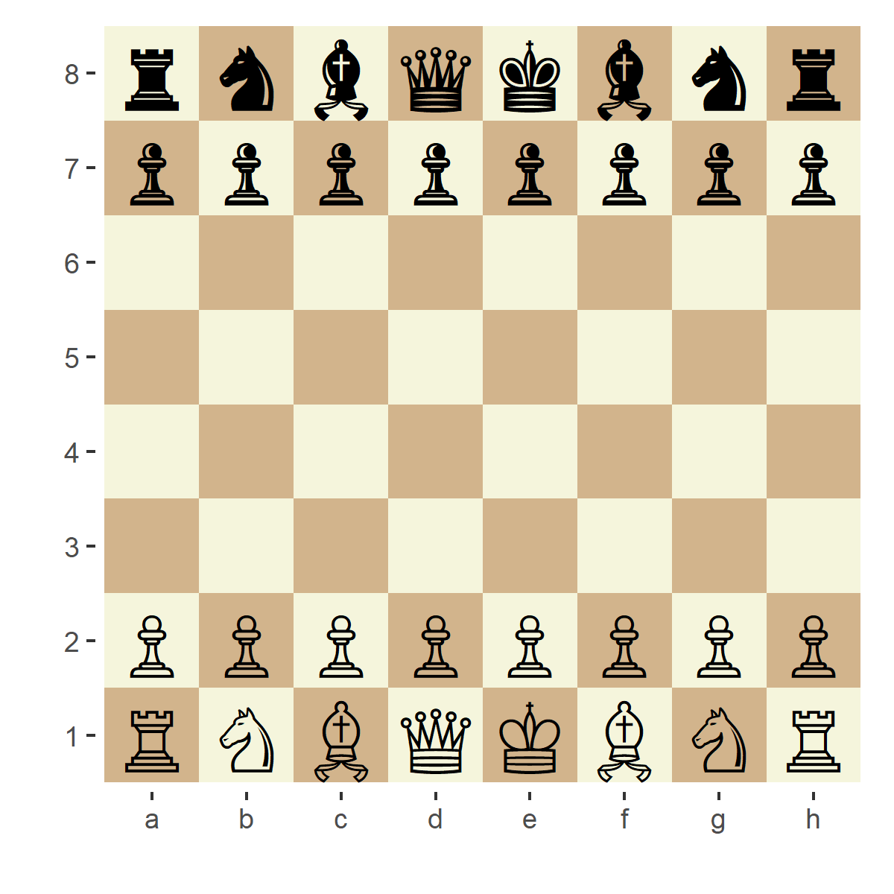

```{r setup, include=FALSE}
knitr::opts_chunk$set(echo = TRUE)
devtools::load_all()
# library(memoise) # getting results faster when working on the file
# gameAnalysis = memoise(gameAnalysis)
# stockStep = memoise(stockStep)
```

## stockfisher

`stockfisher` is an R interface for UCI based chess engines. Any chess engine can
be used but it comes with and tested with stockfish.

### Using stockfisher

The first thing that should be done is to spawn an engine process. If an engine is not 
spawned, `stockStep` and `pgnAnalysis` functions will spawn their own processes and
terminate at function termination which might add some overhead.

To start the stockfish engine that is included in the package, use

```{r startStockfish}
stockfish = startStockfish()
```

If you want to start a different engine or your own stockfish installation just do

```r
engine = subprocess::spawn_process('path/to/engine')
```

Spawning a process beforehand is also good if you want to set some engine parameters.

```{r setOptions}
# see available options
getOptions(stockfish)
# set the move overhead to 30
setOptions(stockfish,optionList = list(`Move Overhead` = 30))
```

### Next best move

`stockStep` function will analyze the current position of the board and return you
the next best move the engine can come up with. It also gives you the best opposing move
(if it can), and the score for the current position from it's perspective (positive
integers if the engine is winning, negative if its losing).

As an input it accepts a `Chess` object from the `rchess` package or a string that
could be read by UCI (FEN notation or something like `startpos moves e2e4`).

```{r stockStep}
library(rchess)

board = Chess$new()

# use the position of the board as input
# think for 2 seconds and return the bestmove it could think of
stockStep(board,movetime= 2000, stockfish = stockfish)

# use the string as input
stockStep(posString = 'startpos moves e2e4',movetime= 1000, stockfish = stockfish)

```

If you want to pass a move back to the rchess board, the short algebraic notation
should be used. You can have `stockStep` to return in this format using the `translate`
argument.

```{r stockStepTranslate}
stockStep(board,movetime= 2000, stockfish = stockfish,translate = TRUE)
```
Note that the input must always be an `rchess` board rather than the `startPos` argument for this to work.

### Game analysis

If you have a pgn file or an `rchess` board with a history, `gameAnalysis` function
can be used to analyze all moves of the game and return best moves and scores. The
scores returned are always from the point of view of the white player. The
processing time is controlled by the `movetime` or `depth` arguments. Below I analyze
a Kasparov vs Topalov game whose pgn is included in the rchess package.

```{r gameAnalysis}
pgn = system.file("extdata/pgn/kasparov_vs_topalov.pgn", package = "rchess")
pgn = readLines(pgn, warn = FALSE)
pgn <- paste(pgn, collapse = "\n")

board = rchess::Chess$new()
board$load_pgn(pgn)

# either pgn or board can be used as an input for gameAnalysis

evaluations = gameAnalysis(pgn,movetime = 500,stockfish = stockfish,progress = FALSE)
scores = evaluations$score
# if a score is of type mate, it no longer counts in centipawns but turns
# left for an expected mate. Here I process these to be one above the maximum cp value.
# this game does not include a mate evaluation so this line does nothing
scores[evaluations$scoreType=='mate'] = (evaluations$score %>% max)+1
plot(scores)
```

In this plot positive scores indicate a white advantage while negative
indicates black advantage. This game is ultimately won by Kasparow, the white player.
If you allow the engine to think longer, the evaluations will be more accurate.

### Saving game animations

You can save and create animations of rchess boards with history using `animateGame`.
`animateGame` invisibly returns a `magick-image` object.

```{r animateGame}
dir.create('README_files',showWarnings = FALSE)
animateGame(board,file = 'README_files/kasparov_vs_topalov.gif',
            width = 4,
            height = 4,
            fps = 1,
            piecesize = 12)
```


### Running games

Here I'll use `stockfisher` to run a timed game between 2 AI opponents. 2 stockfish
sessions are used here to demonstrate pondering (setting `ponder=TRUE` allows
the engine to continue processing assuming the opponent will move as predicted in `ponder`).
In this context one of the players can be replaced with a different engine. A simpler implementation
with a single session is also possible if you just want to see how the engine functions
under different parameters without pondering.

```{r runningGame}
library(tictoc)


players = list(
    w = startStockfish(),
    b = startStockfish()
)

# an estimate of the move overhead
setOptions(players$w,optionList = list(`Move Overhead` = 400))
setOptions(players$b,optionList = list(`Move Overhead` = 400))


ponder = list(
    w = '',
    b = ''
)

# 2 minute timer for each player
timer = list(
    w = 120000,
    b = 120000
)

board = Chess$new()
while(!board$game_over() & timer[[board$turn()]] > 0){
    turn = board$turn()
    history = board$history()
    tic()

    if(!is.na(ponder[[turn]]) && length(history)>0 && history[length(history)] == ponder[[turn]]){
        # if the opponent moves as the engine predicted, send a ponderhit
        # print('ponderhit')
        move = ponderhit(board,
                  wtime = timer$w,
                  btime = timer$b,
                  translate = TRUE,
                  ponder = TRUE,
                  stockfish = players[[turn]])
    } else{
        # if the engine couldn't predict how the opponent will move in the previous turn, get the best move as normal
        # print('normal move')
        move = stockStep(board,
                         wtime = timer$w,
                         btime = timer$b,
                         translate = TRUE,
                         stockfish = players[[turn]],
                         ponder = TRUE)  
    }
    board$move(move$bestmove)
    ponder[[turn]] = move$ponder
    # update timers
    time = toc(quiet = TRUE)
    timePassed = 1000*(time$toc - time$tic)
    timer[[turn]] = unname(timer[[turn]] - timePassed)
    # overhead calculation. negative returns are due to added ponder time.
    # tend to fluctuate between 350-250 on my machine
    # overhead = timePassed-(move$time)
    # print(overhead)

}
# shutdown both player processes
players %>% sapply(stopStockfish) %>% invisible()
# save game for a later look
writeLines(board$pgn(),'README_files/stockfish_vs_stockfish.pgn')

# animate the game board
animateGame(board,file = 'README_files/stockfish_vs_stockfish.gif',
            width = 4,
            height = 4,
            fps = 1,
            piecesize = 12)

```


The resulting game can be analyzed using `gameAnalysis`. These games tend to end in
a stalemate as both engines have access to the same resources. One could try giving
less time to one of the players but with pondering on, any time one player spends
thinking gives other player the time to think, especially since they are more likely
to ponderhit each other since they are the same engine.

```{r stockfishAnalysis}
evaluations = gameAnalysis(board,movetime = 500,stockfish = stockfish,progress = FALSE)
scores = evaluations$score
scores[evaluations$scoreType=='mate'] = (evaluations$score %>% max)+1
plot(scores)
```

How did the game end? `rchess` doesn't include a single function to get the game
state to we have

```{r gameState}
gameState(board)
```


Finally use `stopStockfish` to stop the engine process

```{r stop}
stopStockfish(stockfish)
```