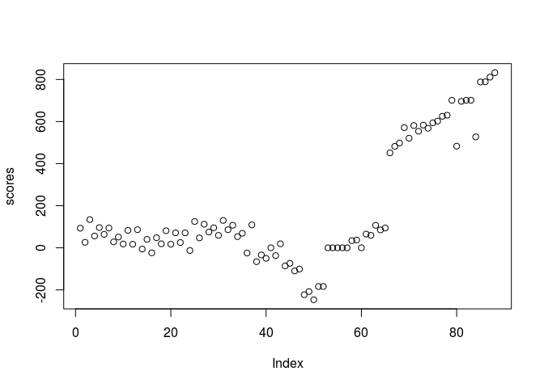

stockfisher
-----------

`stockfisher` is an R interface for UCI based chess engines. Any chess engine can be used but it comes with and tested with stockfish.

### Using stockfisher

The first thing that should be done is to spawn an engine process. If an engine is not spawned, `stockStep` and `pgnAnalysis` functions will spawn their own processes and terminate at function termination which might add some overhead.

To start the stockfish engine that is included in the package, use

``` r
stockfish = startStockfish()
```

If you want to start a different engine or your own stockfish installation just do

``` r
engine = subprocess::spawn_process('path/to/engine')
```

Spawning a process beforehand is also good if you want to set some engine parameters.

``` r
# see available options
getOptions(stockfish)
```

    ## Warning: package 'bindrcpp' was built under R version 3.4.4

    ##                     name
    ## 1         Debug Log File
    ## 2               Contempt
    ## 3      Analysis Contempt
    ## 4                Threads
    ## 5                   Hash
    ## 6             Clear Hash
    ## 7                 Ponder
    ## 8                MultiPV
    ## 9            Skill Level
    ## 10         Move Overhead
    ## 11 Minimum Thinking Time
    ## 12            Slow Mover
    ## 13             nodestime
    ## 14          UCI_Chess960
    ## 15       UCI_AnalyseMode
    ## 16            SyzygyPath
    ## 17      SyzygyProbeDepth
    ## 18      Syzygy50MoveRule
    ## 19      SyzygyProbeLimit
    ##                                                            info
    ## 1                                          type string default 
    ## 2                         type spin default 24 min -100 max 100
    ## 3  type combo default Both var Off var White var Black var Both
    ## 4                             type spin default 1 min 1 max 512
    ## 5                         type spin default 16 min 1 max 131072
    ## 6                                                   type button
    ## 7                                      type check default false
    ## 8                             type spin default 1 min 1 max 500
    ## 9                             type spin default 20 min 0 max 20
    ## 10                          type spin default 30 min 0 max 5000
    ## 11                          type spin default 20 min 0 max 5000
    ## 12                         type spin default 84 min 10 max 1000
    ## 13                          type spin default 0 min 0 max 10000
    ## 14                                     type check default false
    ## 15                                     type check default false
    ## 16                                  type string default <empty>
    ## 17                            type spin default 1 min 1 max 100
    ## 18                                      type check default true
    ## 19                              type spin default 7 min 0 max 7

``` r
# set the move overhead to 30
setOptions(stockfish,optionList = list(`Move Overhead` = 30))
```

### Next best move

`stockStep` function will analyze the current position of the board and return you the next best move the engine can come up with. It also gives you the best opposing move (if it can), and the score for the current position from it's perspective (positive integers if the engine is winning, negative if its losing).

As an input it accepts a `Chess` object from the `rchess` package or a string that could be read by UCI (FEN notation or something like `startpos moves e2e4`).

``` r
library(rchess)
```

    ## Warning: package 'rchess' was built under R version 3.4.4

``` r
board = Chess$new()

# use the position of the board as input
# think for 2 seconds and return the bestmove it could think of
stockStep(board,movetime= 2000, stockfish = stockfish)
```

    ## $bestmove
    ## [1] "e2e4"
    ## 
    ## $ponder
    ## [1] "e7e5"
    ## 
    ## $score
    ## [1] 72
    ## 
    ## $scoreType
    ## [1] "cp"

``` r
# use the string as input
stockStep(posString = 'startpos moves e2e4',movetime= 1000, stockfish = stockfish)
```

    ## $bestmove
    ## [1] "e7e5"
    ## 
    ## $ponder
    ## [1] "g1f3"
    ## 
    ## $score
    ## [1] -13
    ## 
    ## $scoreType
    ## [1] "cp"

If you want to pass a move back to the rchess board, the short algebraic notation should be used. You can have `stockStep` to return in this format using the `translate` argument.

``` r
stockStep(board,movetime= 2000, stockfish = stockfish,translate = TRUE)
```

    ## $bestmove
    ## [1] "d4"
    ## 
    ## $ponder
    ## [1] "Nf6"
    ## 
    ## $score
    ## [1] 63
    ## 
    ## $scoreType
    ## [1] "cp"

Note that the input must always be an `rchess` board rather than the `startPos` argument for this to work.

### Game analysis

If you have a pgn file or an `rchess` board with a history, `gameAnalysis` function can be used to analyze all moves of the game and return best moves and scores. The scores returned are always from the point of view of the white player. The processing time is controlled by the `movetime` or `depth` arguments. Below I analyze a Kasparov vs Topalov game whose pgn is included in the rchess package.

``` r
pgn = system.file("extdata/pgn/kasparov_vs_topalov.pgn", package = "rchess")
pgn = readLines(pgn, warn = FALSE)
pgn <- paste(pgn, collapse = "\n")

board = rchess::Chess$new()
board$load_pgn(pgn)
```

    ## [1] TRUE

``` r
# either pgn or board can be used as an input for gameAnalysis

evaluations = gameAnalysis(pgn,movetime = 500,stockfish = stockfish,progress = FALSE)
scores = evaluations$score
# if a score is of type mate, it no longer counts in centipawns but turns
# left for an expected mate. Here I process these to be one above the maximum cp value.
# this game does not include a mate evaluation so this line does nothing
scores[evaluations$scoreType=='mate'] = (evaluations$score %>% max)+1
plot(scores)
```



In this plot positive scores indicate a white advantage while negative indicates black advantage. This game is ultimately won by Kasparow, the white player. If you allow the engine to think longer, the evaluations will be more accurate.

### Saving game animations

You can save and create animations of rchess boards with history using `animateGame`. `animateGame` invisibly returns a `magick-image` object.

``` r
dir.create('README_files',showWarnings = FALSE)
animateGame(board,file = 'README_files/kasparov_vs_topalov.gif',
            width = 4,
            height = 4,
            fps = 1,
            piecesize = 12)
```


### Running games

Here I'll use `stockfisher` to run a 1 minute game between 2 AI opponents. A single session stockfish session is used here but 2 sessions can be started if two different engines are to be used. 2 sessions could also be useful if you want to experiment with pondering but this package's pondering implementation is currently buggy. Sorry about that...

``` r
library(tictoc)
```

    ## Warning: package 'tictoc' was built under R version 3.4.4

``` r
# 1 minute timer for each player
timer = list(
    w = 60000,
    b = 60000
)

board = Chess$new()

while(!board$game_over() & timer[[board$turn()]] > 0){
    turn = board$turn()
    history = board$history()
    tic()
    move = stockStep(board,
                     wtime = timer$w,
                     btime = timer$b,
                     translate = TRUE,
                     stockfish = stockfish)  

    board$move(move$bestmove)
    time = toc(quiet = TRUE)
    timePassed = 1000*(time$toc - time$tic)
    timer[[turn]] = unname(timer[[turn]] - timePassed)
    
}

animateGame(board,file = 'README_files/stockfish_vs_stockfish.gif',
            width = 4,
            height = 4,
            fps = 1,
            piecesize = 12)
```


Finally use `stopStockfish` to stop the engine process

``` r
stopStockfish(stockfish)
```

    ## [1] TRUE
